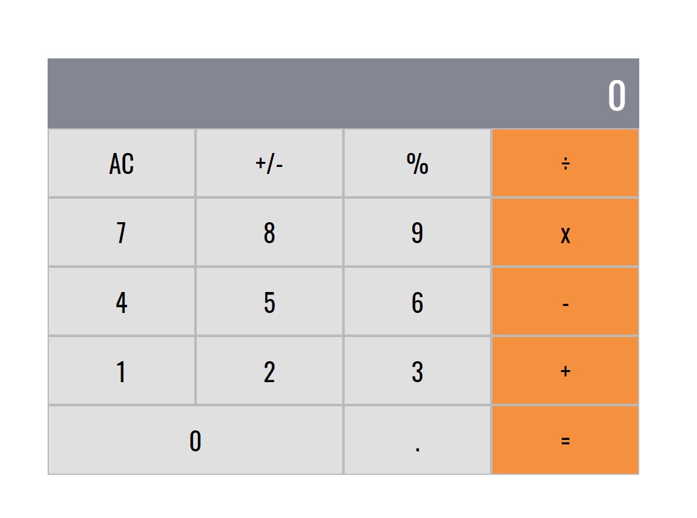

# Math magicians

> "Math magicians" is a website for all fans of mathematics. It is a Single Page App (SPA) that allows users to:

- Make simple calculations.
- Read a random math-related quote.

### Screenshot

## Built With

- React
- CSS

## Live Demo

[Check here the Live Demo!](https://shadyshawkat.github.io/Math-magicians/)

### Prerequisites

- npm or yarn
- git
- A text editor
- A recent version of a browser (tested in Firefox and Chrome)

### Setup

1. Open a command line
2. Clone the project to your computer with `git clone git@github.com:ShadyShawkat/Math-magicians.git`
3. Go into the folder to the project with `cd Math-magicians`
4. Build the node modules with `npm install`. 

### Usage

Any change to the project should be done in the folder `src`.

## Author

👤 **Shady Shawkat**

- GitHub: [@ShadyShawkat](https://github.com/ShadyShawkat)
- Twitter: [@ShadyShawkat3](https://twitter.com/ShadyShawkat3)
- LinkedIn: [Shady Shawkat](https://linkedin.com/in/Shady-Shawkat)

## 🤝 Contributing

Contributions, issues, and feature requests are welcome!

Feel free to check the [issues page](https://github.com/ShadyShawkat/Math-magicians/issues).

## Show your support

Give a ⭐️ if you like this project!

## Acknowledgments

- Hat tip to anyone whose code was used
- Inspiration
- etc

## 📝 License

This project is [MIT](./MIT.md) licensed.
